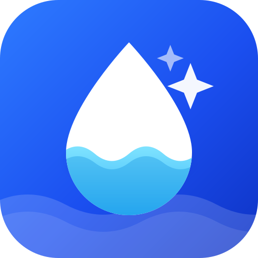

<p align="center">
  
</p>

<h1 align="center">Sipwell</h1>
<p align="center"><em>Keep hydrated for a healthy life</em></p>

A water-tracking mobile app built with Expo and React Native. Log what you
drink, watch the glass fill up, get nudged when it is time for the next one.

## Features

**Today** — a big running total over an animated water level that rises as you
approach your goal, your target and next reminder at a glance, a one-tap
quick-add for your usual cup, and a full drink sheet for anything else.

**History** — day, week and month views. The day view scatters each individual
drink across the clock and lists every record for editing or deletion; week and
month roll up into bars with a dashed goal line and tap-to-inspect values.

**Insights** — fifteen short articles across five categories, from hydration
basics to what alcohol actually does to your fluid balance.

**Me** — reminders, sound and haptics, daily goal, body data, drink types,
units, week start, day boundary and time format.

Alongside that: an onboarding flow that derives your goal from body weight and
waking hours, seventeen drink types each carrying its own hydration factor (a
coffee counts for 80% of its volume, a beer for 40%), daily streaks, local
notification scheduling in smart / interval / custom modes, and a Pro screen for
the premium drink set.

Everything is stored on device with AsyncStorage. There is no account, no
server and no analytics.

## Running it

```bash
npm install
npx expo start          # then scan the QR code with Expo Go
npx expo start --android
npx expo start --ios
npx expo start --web
```

Reminders use `expo-notifications`, which needs a development build or a real
device to deliver on a schedule — they will not fire in a web session.

## Layout

```
app/                        expo-router routes
  (tabs)/                   Today · History · Insights · Me
  onboarding/               first-run setup
  article/[id].tsx          article reader
  reminders · goal · body · drinks · units · day-start · pro · rate · legal
src/
  components/               wave, charts, sheets, icons, shared UI
  store/                    HydrationProvider, defaults, AsyncStorage
  lib/                      units, time, dates, goal maths, notifications, feedback
  data/                     drinks, articles, sound effects
assets/
  brand/                    logo source (SVG) and exports
  sounds/                   five water sound effects
```

## Design notes

The daily target is roughly 33–36 ml per kilogram of body weight depending on
gender, clamped to a sane range and rounded to the nearest 10 ml. You can
override it, and once you do it stops tracking your body data.

Volumes are always stored in millilitres and converted only for display, so
switching between metric and imperial never loses precision.

"A Day Starts At" shifts which logical day a drink belongs to, so a glass at
1am can still count toward the night before.

The five sound effects are synthesised, not sampled — see the generator note in
`assets/sounds`.

## Not wired up

The Pro screen has no payment provider behind it; subscribing unlocks the
entitlement locally so the premium drinks can be tried. Language options are a
single entry, and there is no home-screen widget yet.

Sipwell is a wellbeing tool, not a medical device. The goals it suggests are
estimates.
